# NC2.5 — Architectural Evolution with Navigational Cybernetics. Part One — The Crown

**The crown of evolution is not a summit but the front of retained continuations of nested identities.**

[](https://doi.org/10.17605/OSF.IO/ZYBT7)
[](https://creativecommons.org/licenses/by-nc-nd/4.0/)
[](#verification-harness)
[](#verification-harness)
[](#verification-harness)
[](https://doi.org/10.17605/OSF.IO/NHTC5)

<p align="center">
  
</p>

*The diagram cycles through four views — Operator Zero, the forming field 0&#8594;1, the Unit and its crown, and a nested substrate whose metamorphosis narrows the continuations of the level above it (§2, §3, §6, §10–11).*

This repository contains the canonical English manuscript of *Architectural Evolution with Navigational Cybernetics. Part One — The Crown* together with its executable structural verification harness, as one citable work in the NC2.5 (Navigational Cybernetics 2.5) corpus.

> **Status (read first).** The manuscript is an architectural essay and operator specification. The harness checks the public manuscript's structure, mathematical delimiter discipline, declared textual bindings, and selected corpus-hygiene invariants. Its mutation battery demonstrates that each included check rejects its targeted change. The harness does not verify cited works, establish empirical claims, replace mathematical reading, or turn the essay into a proof-assistant formalisation.

**Author:** Maksim Barziankou (MxBv) — [LinkedIn](https://www.linkedin.com/in/maxbarzenkov)  
**Affiliation:** The Urgrund Laboratory  
**Website:** https://petronus.eu  
**License:** CC BY-NC-ND 4.0  
**Work DOI:** 10.17605/OSF.IO/ZYBT7  
**Axiomatic core anchor:** NC2.5 v2.1, DOI 10.17605/OSF.IO/NHTC5  
**Corpus:** one work in the Navigational Cybernetics 2.5 corpus  

## Contents

| # | File | Role |
|---|---|---|
| 1 | `CROWN-OF-EVOLUTION-EN.md` | canonical English manuscript: Operator Zero, the Unit and field I, crowns of evolution, nested substrates, retained fields, computation of nested reality, change of position, and closure |
| — | `harness/gate_en.py` | deterministic structural gate and mutation battery for the canonical manuscript; Python standard library only |
| — | `MANIFEST.md` | repository inventory, declared checks, scope, and run commands |

## Verify in one minute

```bash
git clone https://github.com/petronushowcore-mx/Architectural-Evolution-with-Navigational-Cybernetics-Part-One-The-Crown.git
cd Architectural-Evolution-with-Navigational-Cybernetics-Part-One-The-Crown
python -B harness/gate_en.py
python -B harness/gate_en.py --teeth
```

Green means that all 12 structural checks pass and all 17 registered mutations behave as declared. No dependencies and no build step are required — Python 3 standard library only.

## Recommended reading order

1. **Manuscript** — read the architectural argument and its declared scope from the beginning; the formal vocabulary accumulates across the work.
2. **Harness** — run the structural checks against the intact repository layout, then run the mutation battery to see the discriminators fail on their targeted changes.

## Verification harness

From the repository root:

```bash
python -B harness/gate_en.py
python -B harness/gate_en.py --teeth
python -B -O harness/gate_en.py
python -B -O harness/gate_en.py --teeth
```

Every command exits non-zero on failure. The normal run checks display and inline mathematics delimiters, heading sequence, editorial residue, the declaration contract, section references, escape artefacts, brace balance, quote convention and punctuation, heading-case consistency, and DOI completeness for cited corpus works. The mutation run targets those checks individually and reports `teeth: 17/17` when every registered case behaves as declared.

**Layout.** The harness resolves `CROWN-OF-EVOLUTION-EN.md` relative to `harness/`. Run it from an intact clone, or set `CROWN_MANUSCRIPT` explicitly when checking an equivalent local copy.

## How to cite

> Barziankou, M. (2026). *Architectural Evolution with Navigational Cybernetics. Part One — The Crown*. Navigational Cybernetics 2.5 corpus, The Urgrund Laboratory. DOI: [10.17605/OSF.IO/ZYBT7](https://doi.org/10.17605/OSF.IO/ZYBT7)

```bibtex
@misc{barziankou2026crown,
  author = {Barziankou, Maksim},
  title  = {Architectural Evolution with Navigational Cybernetics. Part One --- The Crown},
  year   = {2026},
  doi    = {10.17605/OSF.IO/ZYBT7},
  note   = {Navigational Cybernetics 2.5 corpus. The Urgrund Laboratory. License CC BY-NC-ND 4.0.}
}
```

## License

Creative Commons Attribution-NonCommercial-NoDerivatives 4.0 International (CC BY-NC-ND 4.0).

Contact: research@petronus.eu
